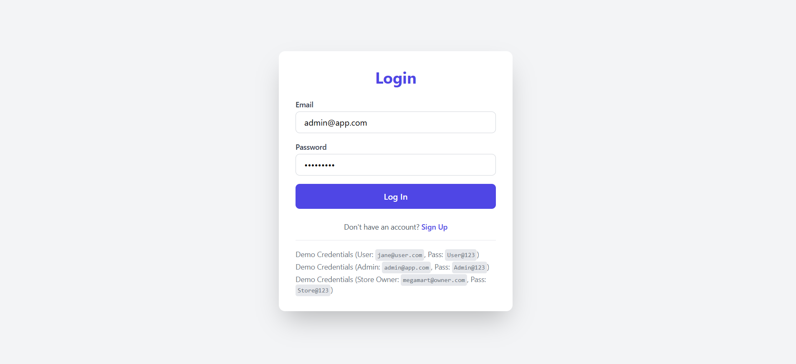

# Rating Platform

> Completed for the **FullStack Intern Coding Challenge**. This web application lets users submit 1-5 star ratings for registered stores, while enforcing role-based access, rigorous validation rules, and secure best practices across the stack.

## Screenshots

| Login | Admin Dashboard |
| --- | --- |
|  |  |

## Tech Stack

- **Frontend**: React (UMD build) + Tailwind CSS, served from `backend/index.html`
- **Backend**: Express.js (REST API, JWT auth, bcrypt password hashing)
- **Database**: PostgreSQL with normalized schema, triggers, and indices
- **Auth**: JWT (24h expiry) stored in `localStorage`, bcrypt with 10 salt rounds
- **Tooling**: Node.js scripts for DB setup/seed, Lucide icons, Fetch API

## Architecture Overview

- **Single login entry point** for every role; role is decoded from JWT to determine dashboard.
- **CSR frontend** (React) communicates with `/api/*` endpoints via the `API` helper in `main.js`.
- **Express server** handles validation, RBAC middleware (`authenticateToken`, `requireAdmin`, etc.), and Postgres queries through node-postgres pools.
- **Database layer** contains `users`, `stores`, `ratings` tables with strict constraints, triggers updating `updated_at`, and unique indexes for performance.
- **Automation scripts** (`db/setup.js`, `db/seedData.js`) guarantee reproducible environments.

## Feature Matrix by Role

### System Administrator
- Add admin or normal users (name, email, password, address, role) and create stores with associated store-owner accounts.
- Dashboard KPIs: total users, stores, and submitted ratings.
- Filter and sort all tables (Name, Email, Address, Role) with instant search.
- View store list with average ratings and store owner user list (store owners show their rating badge).
- Update own password and log out securely.

### Normal User
- Self-registration form (name, email, address, password) with live validation.
- Login, receive JWT, and persist session client-side.
- Browse/search all stores (by name or address), see global rating + their own submission side-by-side.
- Submit or edit ratings (1-5) per store; client validates before hitting `/api/ratings` which upserts server-side.
- Change password via modal and log out.

### Store Owner
- Log in with shared portal, but redirected to the store-owner dashboard after JWT decode.
- View average rating for their store plus total rating count.
- See a table of users who rated them (user email + rating) with live updates.
- Change password and log out.

## Validation Rules (Frontend + Backend)

- **Name**: 20-60 characters (challenge requirement)
- **Address**: Max 400 characters
- **Password**: 8-16 characters, at least one uppercase and one special character from `!@#$%^&*()`
- **Email**: RFC-5322-compliant regex validation
- **Rating**: Integer 1 through 5 inclusive

## Additional UX Requirements Met

- Sort toggles for every table column (ascending/descending arrows).
- Search bars and role filters to constrain data sets instantly.
- Toast-style alerts and inline error messages for validation failures.
- Responsive layout with Tailwind, ensuring parity across admin/user/owner dashboards.

## Project Structure

```
rating-platform/
├── README.md
├── backend/
│   ├── index.html           # Frontend shell (loads React, Tailwind, Babel)
│   ├── main.js              # Entire React application + API utilities
│   ├── .env                 # DB credentials (edit DB_PASSWORD)
│   ├── backend/
│   │   ├── package.json     # Scripts + dependencies
│   │   ├── server.js        # Express API
│   │   ├── login-request.js # Smoke-test script
│   │   └── debug-login.js   # DB credential debugger
│   └── db/
│       ├── schema.sql       # DDL with triggers + indices
│       ├── seed.sql         # Reference-only seed outline
│       ├── seedData.js      # Bcrypt + data seeding script
│       └── setup.js         # Database bootstrapper
└── docs/
    └── images/              # README screenshots
```

## Getting Started

### 1. Prerequisites

- Node.js 18+
- PostgreSQL 12+
- PowerShell (Windows) or any shell capable of running the scripts

### 2. Configure Environment Variables

The repository already ships with `backend/.env`. Edit it so `DB_PASSWORD` matches your local Postgres password:

```env
DB_USER=postgres
DB_HOST=localhost
DB_DATABASE=rating_platform
DB_PASSWORD=YourActualPassword
DB_PORT=5432
JWT_SECRET=please-change-this
```

### 3. Install Dependencies

```powershell
cd backend\backend
npm install
```

### 4. Create Database & Schema

Option A: run the helper script (recommended):

```powershell
cd backend\backend
$env:NODE_PATH="./node_modules" ; node ../db/setup.js
```

Option B: manually create DB and run `db/schema.sql` inside `psql`.

### 5. Seed Sample Data

```powershell
cd backend\backend
npm run seed
```

Outputs include admin, normal users, store owners, stores, and starter ratings (credentials below).

### 6. Start the Backend API

```powershell
cd backend\backend
npm start
# Server running at http://localhost:3001
```

Keep this terminal open.

### 7. Serve the Frontend

```powershell
cd backend
python -m http.server 8000
# or: npx serve -p 8000
```

Visit `http://localhost:8000` in a browser and log in with any seeded account.

## Seeded Accounts

| Role | Email | Password |
| --- | --- | --- |
| Admin | `admin@app.com` | `Admin@123` |
| Normal User | `jane@user.com` | `User@123` |
| Store Owner | `megamart@owner.com` | `Store@123` |
| Additional Users | `alice@test.com`, `bob@test.com` | `User@123` |

## API Surface

| Method | Endpoint | Description |
| --- | --- | --- |
| `POST` | `/api/auth/login` | Shared login for every role (returns JWT + user profile) |
| `POST` | `/api/auth/signup` | Normal user self-registration |
| `GET` | `/api/data/users` | List all users (admin sees store IDs) |
| `GET` | `/api/data/stores` | List stores with owner references |
| `GET` | `/api/data/ratings` | Ratings joined with user emails |
| `POST` | `/api/admin/users` | Admin-only user creation |
| `POST` | `/api/admin/stores` | Admin creates store + owner in a transaction |
| `PUT` | `/api/users/:userId/password` | Password update (self or admin) |
| `POST` | `/api/ratings` | Submit/update rating (conflict upsert) |

All protected endpoints require `Authorization: Bearer <token>` headers. Middleware ensures the JWT is valid and verifies role requirements.

## Database Schema Summary

- **users**: stores every account (admin, user, store_owner). Constraints enforce unique email, role whitelist, and name/address length. Passwords are bcrypt hashes.
- **stores**: ties store metadata to a unique `owner_id` referencing `users(id)` with cascade deletes.
- **ratings**: each `(user_id, store_id)` pair is unique; ratings constrained between 1 and 5. Foreign keys cascade deletes so orphaned data cannot exist.
- **Triggers**: `update_updated_at_column` refreshes `updated_at` timestamps automatically for all tables.
- **Indexes**: email, role, owner_id, and rating combinations keep dashboard requests fast.

## Helpful Scripts

| Script | Purpose |
| --- | --- |
| `npm run setup` | Shortcut for `node ../db/setup.js` (create DB + schema) |
| `npm run seed` | Populate admin/users/stores/ratings with bcrypt hashes |
| `node backend/debug-login.js` | Validate stored bcrypt hashes against a given email/password |
| `node backend/login-request.js` | Boots the server and attempts a login request for quick smoke testing |

## Troubleshooting

- **`password authentication failed`**: confirm `.env` password matches your Postgres superuser password.
- **`database "rating_platform" already exists`**: harmless when running setup; the script detects and reuses it.
- **Port conflicts**: change the port in `server.js` or pass `-p` to the static file server.
- **CORS blocked**: update the whitelist inside `server.js` if you serve the frontend from another origin.
- **JWT expired**: log back in; tokens expire in 24 hours by design.

## Future Improvements

1. Replace CDN React with Vite/CRA build pipeline and module bundling.
2. Add pagination and column-level filters backed by the API.
3. Ship automated tests (unit/integration) and CI workflows.
4. Introduce refresh tokens + silent re-auth flows.
5. Support store images and richer analytics visualizations.

---

This repository is ready for upload to GitHub. Update `.env`, run the setup + seed scripts, and the platform is production-complete for the challenge submission.
